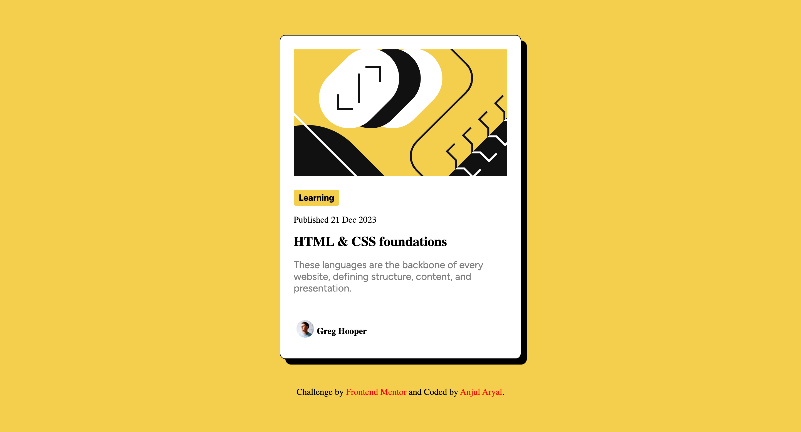

## Overview
This project is based on the blog-preview-card challenge from Frontend Mentor. The challenge allowed me to practice structuring a simple yet effective component, reinforcing my HTML and CSS skills.

### The challenge

Users should be able to:

- See hover and focus states for all interactive elements on the page

### Screenshot

### Links

- Solution URL: [https://www.frontendmentor.io/solutions/responsive-blog-preview-card-jQLWkS86NJ]
- Live Site URL: [https://anjularyal.github.io/Blog-Preview-Card/]

## My process

### Built with

- Semantic HTML5 markup
- CSS custom properties
- Flexbox
- CSS Grid
### What I learned
This project taught me various things like using box shadows and hover effects. I also learned how to target specific elements within the main container.
### Continued development
I plan to focus more on improving the responsiveness of the layout for various devices.

### Useful resources
MDN Docs and W3Schools were extremely helpful in learning the concepts for this project.

## Author
- Github - (https://github.com/AnjulAryal)

## Acknowledgments

I'd like to give credit to the Frontend Mentor community for providing such valuable challenges, and to the documentation from MDN and W3Schools that helped me throughout this project.

# Blog-Preview-Card
